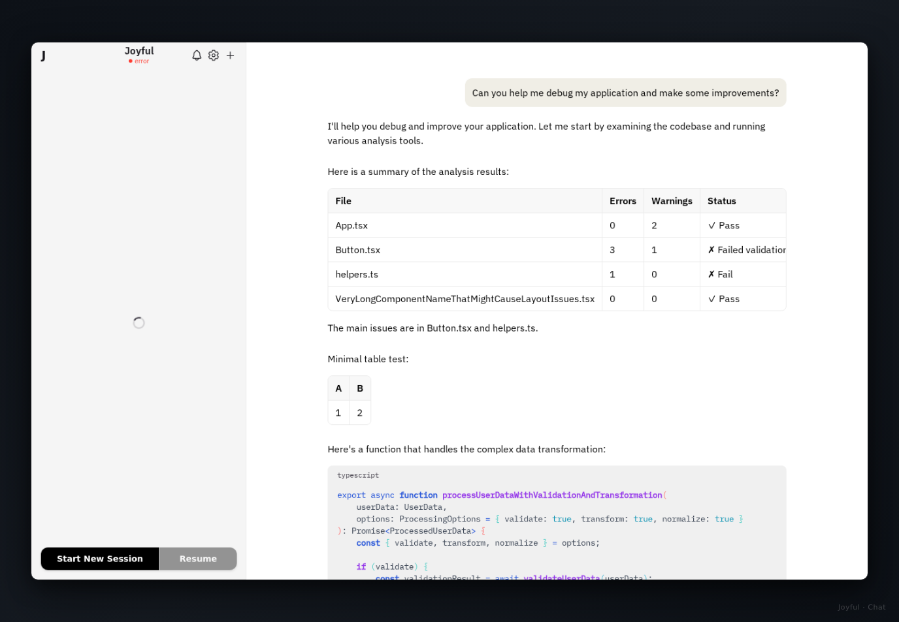
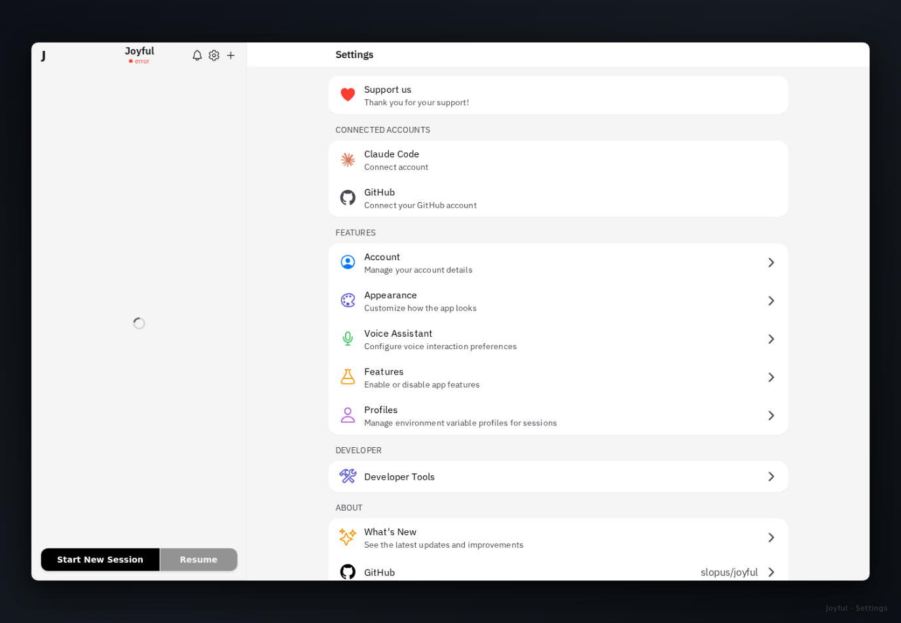
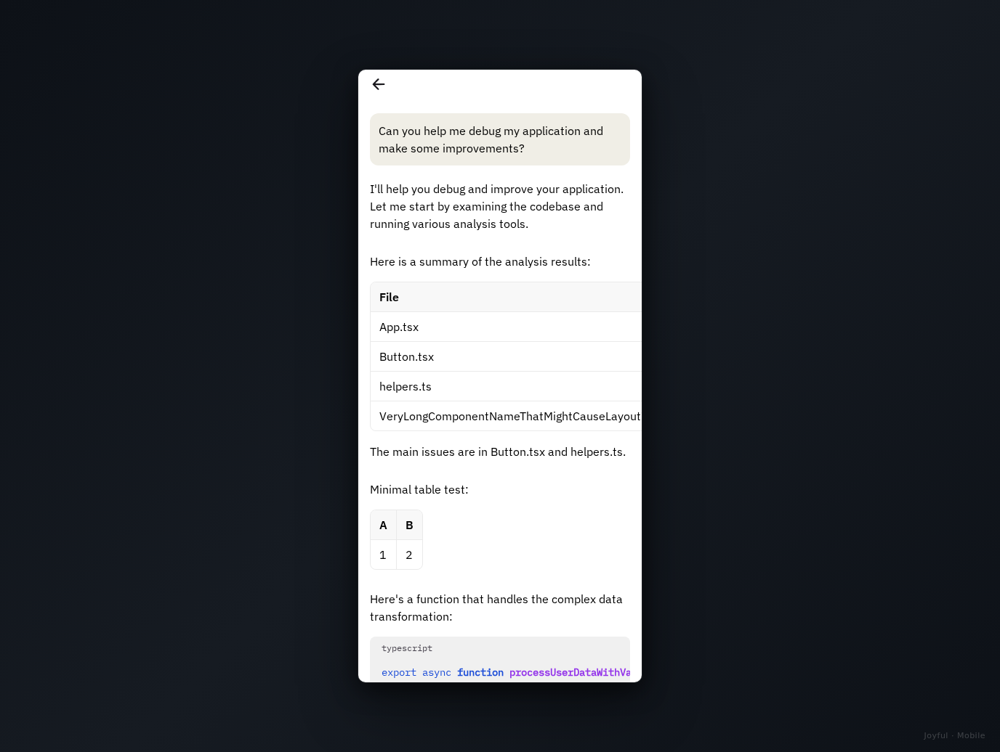
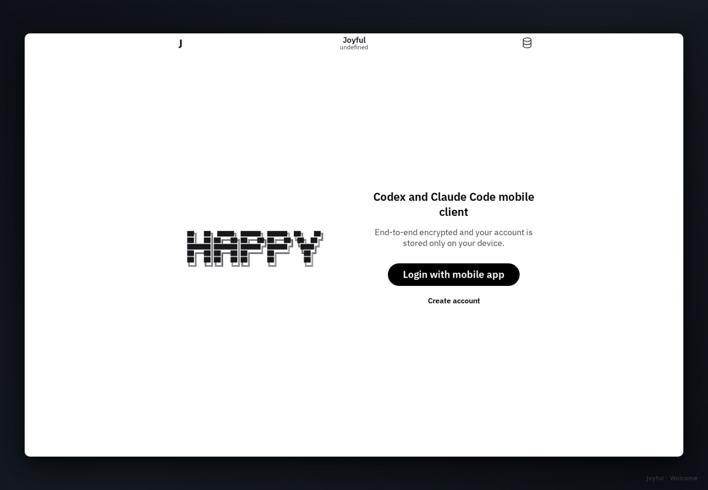

## About this fork

This is a fork of [Happy Coder](https://github.com/slopus/happy), maintained with a focus on orchestrating Claude Code instances. Expect more frequent feature additions and bug fixes relative to upstream.

### Changes from upstream

<!-- changelog-summary: 2026-03-29 (fork base: d343330c) -->

<details>
<summary><strong>🌿 Worktrees</strong> — isolated branch sessions with AI-assisted merge</summary>

| Feature | What it does |
|---------|--------------|
| Git worktree sessions | New session type that creates an isolated git worktree branch; agent works there while other sessions continue on main |
| Worktree session grouping | Worktree sessions appear under their base repo group in the session list, not as separate isolated groups |
| Branch name as title | Worktree sessions show the branch name (e.g. `bold-aurora`) as subtitle; slightly smaller title keeps them visually distinct |
| Merge button in header | Git-merge icon in the chat header navigates directly to the merge screen for any worktree session |
| Agent-delegated merge | "Merge with AI" dispatches a single prompt; agent handles spec checks, conflict resolution, conventional commit message, and squash merge |
| Return-to-merge banner | Blue pill in session view when navigated from the merge screen; tap to return once the agent signals completion |

</details>

<details>
<summary><strong>🤖 Claude Code</strong> — OpenSpec toolbar, model controls, and session defaults</summary>

| Feature | What it does |
|---------|--------------|
| OpenSpec inline toolbar | Mode buttons (Explore, Patch, Apply, FF) shown inline on wide layouts (≥640px) with a vertical divider before model controls; submenu preserved on narrow screens |
| Emoji from content | Chat title emoji reflects actual subject matter, not the OpenSpec command prefix used to trigger it |
| OpenSpec submenu | Explore, Patch, Open Panel in one toolbar menu; active mode shown as icon + label |
| Yolo permission default | New sessions default to `bypassPermissions`/`yolo`; green/red indicator |
| Inline model & effort toggles | `[Snt\|Ops]` and `[Std\|1M]` pickers replace gear icon; effort shown as chevrons |
| Bedrock model support | `bedrock-claude-*` variants in model pickers for Bedrock gateways |
| Model & effort from settings | CLI reads `~/.claude/settings.json` and surfaces defaults to the app |
| Slash command autocomplete | Typing `/` surfaces recently-seen commands from past sessions |
| OpenSpec panel | In-app panel with active changes, task progress bars, and toolbar badge |
| Explore & Patch mode | One-shot prefix toggles for `/opsx:explore` and `/opsx:patch` |

</details>

<details>
<summary><strong>📋 Sessions</strong> — resume, browse, archive, and persist state</summary>

| Feature | What it does |
|---------|--------------|
| Model & effort persistence | Selected model/effort saved per session, survives restarts |
| Interactive filesystem browser | Navigate remote directory tree in path picker, with hidden-dir toggle |
| Native session browser | Discover and resume existing Claude sessions from `~/.claude/projects/` |
| Split FAB for session resume | Dedicated Resume entry alongside New Session; pick machine, dir, and session |
| Archived sessions | Inactive sessions in a collapsible "Archived (N)" header, collapsed by default |

</details>

<details>
<summary><strong>🎨 UI & UX</strong> — session list, density, avatars, and layout</summary>

| Feature | What it does |
|---------|--------------|
| Project group session list | Sessions grouped by project with collapsible headers; state persisted per device |
| Stable session order | Active sessions within a project group stay in creation-date order rather than jumping on each activity update |
| Stable group ordering | Group order persisted; reorder modal (≡) to move groups up/down |
| + button per group | Tap + on a group header to open new-session screen pre-filled for that project |
| Archive in chat header | Archive icon in the chat header to archive active session in place |
| Compact session rows | No per-row avatar/path; reduced heights; single avatar in group header |
| Emoji session titles | Claude prefixes auto-generated session titles with a relevant emoji |
| Status dot on right | Status indicator moved to row right; text label removed |
| Git history & branches | Tappable branch pill shows all branches (ahead/behind) and last 30 commits |
| Plasma avatar style | Gaussian-blurred triadic blobs with screen blending; CSS fallback for web |
| Plasma avatar web fix | `clip-path: circle()` on the web plasma container ensures blurred blobs are always clipped to a circle; `filter:blur()` children bypassed `overflow:hidden` in browsers |
| Condensed density & dark mode | Tighter rows/items; dark surfaces aligned to iOS palette |
| Mobile layout fixes | Code block wrapping, keyboard-anchored overlays, PWA safe-area |
| Machines panel collapsed | Collapse state persisted; defaults to collapsed |

</details>

<details>
<summary><strong>📊 Monitoring</strong> — quota, memory, and polling</summary>

| Feature | What it does |
|---------|--------------|
| Claude quota widget | 5h/7d rolling-window utilization bars, reset countdown, manual refresh |
| Machine memory stats | Daemon reports total/free RAM + RSS; shown in collapsible sidebar panel |
| Quota polling fixes | Skips API-key-only machines; fixed re-entrant loop causing daemon OOM |

</details>

<details>
<summary><strong>🎙️ Voice</strong> — self-hosted ElevenLabs</summary>

| Feature | What it does |
|---------|--------------|
| Self-hosted ElevenLabs | Agent ID configurable in Settings → Voice; clear errors when unconfigured |

</details>

<details>
<summary><strong>⚡ Performance & Infrastructure</strong> — reconnect, streaming, and daemon co-existence</summary>

| Feature | What it does |
|---------|--------------|
| Reconnect batching | Single batch request on reconnect instead of one per session (~92% fewer) |
| Streaming seq fix | Batched seq allocation eliminates gaps that caused slow REST fallback |
| Socket.IO polling fallback | `['polling', 'websocket']` fixes connections behind restrictive networks |
| Happy daemon co-existence | Runs independently alongside existing `happy`/`happier` daemons |
| Full rename | All identifiers, env vars, home dirs updated from `happy`/`handy` to `joyful` |

</details>

<!-- end-changelog-summary -->

---

<div align="center"></div>

<h1 align="center">
  Mobile and Web Client for Claude Code & Codex
</h1>

<h4 align="center">
Use Claude Code or Codex from anywhere with end-to-end encryption.
</h4>

<div align="center">
  
[📱 **iOS App**](https://apps.apple.com/us/app/joyful-claude-code-client/id6748571505) • [🤖 **Android App**](https://play.google.com/store/apps/details?id=com.ex3ndr.joyful) • [🌐 **Web App**](https://app.joyful.engineering) • [🎥 **See a Demo**](https://youtu.be/GCS0OG9QMSE) • [📚 **Documentation**](https://joyful.engineering/docs/) • [💬 **Discord**](https://discord.gg/fX9WBAhyfD)

</div>


<h3 align="center">
Step 1: Download App
</h3>

<div align="center">
<a href="https://apps.apple.com/us/app/joyful-claude-code-client/id6748571505"></a>&nbsp;&nbsp;&nbsp;&nbsp;&nbsp;<a href="https://play.google.com/store/apps/details?id=com.ex3ndr.joyful"></a>
</div>

<h3 align="center">
Step 2: Run from Source
</h3>

> **Note:** This is a fork — the CLI has not been published to npm. You need to run everything from this repository.

**Prerequisites:** Node.js 20+, Yarn 1.22.22, and [Claude Code](https://docs.anthropic.com/en/docs/claude-code) installed.

```bash
# 1. Clone and install dependencies
git clone https://github.com/datori/joyful.git
cd joyful
yarn install

# 2. Build the CLI
yarn workspace joyful build

# 3. Start the local server + daemon (handles migrations automatically)
yarn dev:stack:start

# 4. Get your seed to link the web app
yarn dev:stack:seed
```

The web app connects to the local server at `http://localhost:3007`:

```bash
# In a separate terminal — starts Expo web on http://localhost:8081
EXPO_PUBLIC_JOYFUL_SERVER_URL=http://localhost:3007 yarn web
```

Open `http://localhost:8081` → Settings → Restore with Secret Key → paste the **base32** seed printed by `yarn dev:stack:seed`.

**Running the CLI:**

```bash
# Run against the local dev stack
JOYFUL_HOME_DIR=~/.joyful-dev JOYFUL_SERVER_URL=http://localhost:3007 yarn cli

# Or use the built binary directly
JOYFUL_HOME_DIR=~/.joyful-dev JOYFUL_SERVER_URL=http://localhost:3007 ./packages/joyful-cli/bin/joyful.mjs
```

**Dev stack commands:**

```bash
yarn dev:stack:start    # Start server + daemon
yarn dev:stack:stop     # Gracefully stop everything
yarn dev:stack:status   # Show what's running
yarn dev:stack:nuke     # Full reset: wipe DB, re-bootstrap, restart
yarn dev:stack:seed     # Print seed in base64url and base32 formats
```

> ⚠️ **PGlite warning:** Never `kill -9` the server — it uses an embedded WASM database that corrupts on hard kills. Always use `yarn dev:stack:stop`.

<h3 align="center">
Release (Maintainers)
</h3>

```bash
# from repository root
yarn release
```

<h3 align="center">
Step 3: Start using `joyful` instead of `claude` or `codex`
</h3>

```bash

# Instead of: claude
# Use: joyful

joyful

# Instead of: codex
# Use: joyful codex

joyful codex

```

<div align="center"></div>

## How does it work?

On your computer, run `joyful` instead of `claude` or `joyful codex` instead of `codex` to start your AI through our wrapper. When you want to control your coding agent from your phone, it restarts the session in remote mode. To switch back to your computer, just press any key on your keyboard.

## 🔥 Why Joyful Coder?

- 📱 **Mobile access to Claude Code and Codex** - Check what your AI is building while away from your desk
- 🔔 **Push notifications** - Get alerted when Claude Code and Codex needs permission or encounters errors  
- ⚡ **Switch devices instantly** - Take control from phone or desktop with one keypress
- 🔐 **End-to-end encrypted** - Your code never leaves your devices unencrypted
- 🛠️ **Open source** - Audit the code yourself. No telemetry, no tracking

## Screenshots


| Chat session | Settings |
|---|---|
|  |  |

| Mobile view | Welcome |
|---|---|
|  |  |

## 📦 Project Components

- **[Joyful App](https://github.com/slopus/joyful/tree/main/packages/joyful-app)** - Web UI + mobile client (Expo)
- **[Joyful CLI](https://github.com/slopus/joyful/tree/main/packages/joyful-cli)** - Command-line interface for Claude Code and Codex
- **[Joyful Agent](https://github.com/slopus/joyful/tree/main/packages/joyful-agent)** - Remote agent control CLI (create, send, monitor sessions)
- **[Joyful Server](https://github.com/slopus/joyful/tree/main/packages/joyful-server)** - Backend server for encrypted sync

## 🏠 Who We Are

We're engineers scattered across Bay Area coffee shops and hacker houses, constantly checking how our AI coding agents are progressing on our pet projects during lunch breaks. Joyful Coder was born from the frustration of not being able to peek at our AI coding tools building our side hustles while we're away from our keyboards. We believe the best tools come from scratching your own itch and sharing with the community.

## 📚 Documentation & Contributing

- **[Documentation Website](https://joyful.engineering/docs/)** - Learn how to use Joyful Coder effectively
- **[CONTRIBUTING.md](CONTRIBUTING.md)** - Development setup including iOS, Android, and macOS desktop variant builds
- **[Edit docs at github.com/slopus/slopus.github.io](https://github.com/slopus/slopus.github.io)** - Help improve our documentation and guides

## License

MIT License - see [LICENSE](LICENSE) for details.
